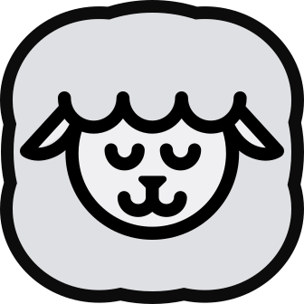

<p align="center">
  
</p>

<h1 align="center">Yumekit</h1>

<p align="center">
  A modern, themeable Web Components UI kit — no framework required.
</p>

<p align="center">
  <a href="https://www.npmjs.com/package/@waggylabs/yumekit"></a>
  <a href="https://github.com/waggylabs/yumekit/blob/main/LICENSE"></a>
</p>

---

## Overview

YumeKit is a collection of 31 production-ready custom elements built with native Web Components. It works with any framework — or none at all — and ships with a comprehensive design token system, built-in theming, an icon registry, and full TypeScript support.

- **Zero dependencies** — built entirely on web standards
- **Framework-agnostic** — works with React, Vue, Svelte, or plain HTML
- **Themeable** — 22 built-in themes plus support for fully custom themes
- **Accessible** — ARIA-compliant, keyboard navigable, form-associated inputs
- **Tree-shakeable** — import only the components you use

---

## Installation

```bash
npm install @waggylabs/yumekit
```

---

## Usage

### Via CDN (script tag)

The IIFE bundle includes all components and icons. Drop it into any HTML page:

```html
<script src="https://cdn.jsdelivr.net/npm/@waggylabs/yumekit/dist/yumekit.min.js"></script>

<y-button color="primary">Click me</y-button>
```

### Via ESM (recommended)

Import the full library or individual components for tree-shaking:

```js
// Full library
import "@waggylabs/yumekit";

// Individual components
import "@waggylabs/yumekit/components/y-theme";
import "@waggylabs/yumekit/components/y-button";
import "@waggylabs/yumekit/components/y-input";
```

Then use the `<y-theme>` component to apply a theme:

```html
<y-theme theme="blue-light">
    <!-- your app content -->
</y-theme>
```

---

## Components

| Component    | Element            | Description                                         |
| ------------ | ------------------ | --------------------------------------------------- |
| App Bar      | `<y-appbar>`       | Top or side navigation bar                          |
| Avatar       | `<y-avatar>`       | User avatar with shape and color variants           |
| Badge        | `<y-badge>`        | Status badge or label                               |
| Button       | `<y-button>`       | Button with icon, size, and style variants          |
| Button Group | `<y-button-group>` | Groups buttons (or inputs) into a connected toolbar |
| Card         | `<y-card>`         | Content card container                              |
| Checkbox     | `<y-checkbox>`     | Form checkbox input                                 |
| Date         | `<y-date>`         | Date input                                          |
| DatePicker   | `<y-datepicker>`   | A date and time picker                              |
| Dialog       | `<y-dialog>`       | Modal dialog                                        |
| Drawer       | `<y-drawer>`       | Side drawer / sidebar                               |
| Icon         | `<y-icon>`         | SVG icon display                                    |
| Input        | `<y-input>`        | Text input field                                    |
| Menu         | `<y-menu>`         | Dropdown navigation menu                            |
| Panel        | `<y-panel>`        | Accordion panel                                     |
| Panel Bar    | `<y-panelbar>`     | Accordion panel group                               |
| Progress     | `<y-progress>`     | Progress bar                                        |
| Radio        | `<y-radio>`        | Radio button input                                  |
| Rating       | `<y-rating>`       | Star / icon rating input                            |
| Select       | `<y-select>`       | Select / dropdown input                             |
| Slider       | `<y-slider>`       | Range slider input                                  |
| Stack        | `<y-stack>`        | Layout container (row, column, grid, masonry)       |
| Switch       | `<y-switch>`       | Toggle switch                                       |
| Table        | `<y-table>`        | Sortable data table                                 |
| Textarea     | `<y-textarea>`     | Multi-line text input                               |
| Tabs         | `<y-tabs>`         | Tabbed interface                                    |
| Tag          | `<y-tag>`          | Tag / chip label                                    |
| Theme        | `<y-theme>`        | Theme provider                                      |
| Toast        | `<y-toast>`        | Notification toast                                  |
| Tooltip      | `<y-tooltip>`      | Tooltip / popover                                   |

---

## TypeScript

Type definitions are included. React-specific type augmentations are available at `@waggylabs/yumekit/react`.

```ts
import "@waggylabs/yumekit";
```

---

## License

MIT © [WaggyLabs](https://github.com/waggylabs)
